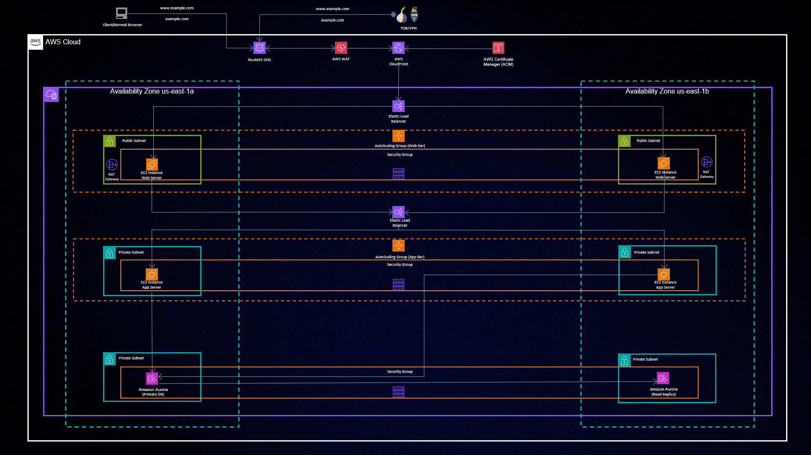

# Three-Tier Architecture Deployment on AWS with Terraform

 </img>

## Introduction

Welcome to the realm of Three-Tier Architecture deployment on Amazon Web Services (AWS) made simple and efficient with Terraform. This repository serves as your gateway to effortlessly setting up a robust and scalable Three-Tier Architecture for your applications. Harness the power of Infrastructure as Code (IaC) and streamline your deployment process like never before.

## Project Overview

This project takes the complexity out of deploying a Three-Tier Architecture on AWS. By automating the creation of your entire infrastructure, it allows you to focus on what matters most – your application's core logic. .

## Getting Started

## Project Highlights

- **VPC: The Foundation**: Create a secure Virtual Private Cloud (VPC) to isolate your application.
- **Load Balancing Magic**: Harness the power of the Application Load Balancer (ALB) for optimal traffic distribution.
- **Auto Scaling Wonders**: Leverage Auto Scaling Group to ensure performance and resilience.
- **Database Sorcery**: Deploy Amazon RDS for managed database services.
- **DNS Mastery**: Use Route 53 for domain registration and DNS management.
- **Static Content Wizardry**: Utilize Amazon S3 to manage static assets/code.

